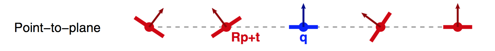
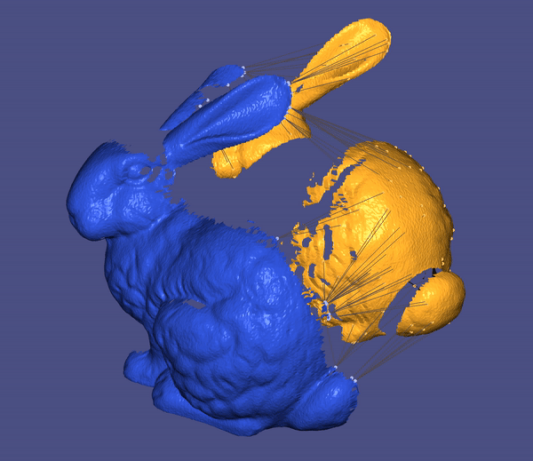

### ICP with symmetric objective

Iterative Closest Point (ICP), a well-known algorithm for registering two meshes, has two main variants using point-to-point and point-to-plane objective functions, respectively. The latter typically benefits more accurate final alignment and faster convergence, while having narrower convergence basin. Point-to-plane objective can be [symmetrized](https://gfx.cs.princeton.edu/pubs/Rusinkiewicz_2019_ASO/symm_icp.pdf) such that it yields better convergence speed and wider convergence basin.

Let's assume we have two surfaces `P` (source) and `Q` (target). Our goal is to align source mesh `P` to target mesh `Q` by transforming the source mesh `P` using rotations and translations. The point-to-plane matching penalizes for each pair of matched points `(p, q)`,

$$\mathbf{(p - q).n_q}$$

In case of inexact correspondences, which is common in practice, this residual vanishes whenever the surface is locally flat. Accordingly, the transformation is free to slide along this zero-set without imposing further penalty:



A greater form of freedom can be achieved by using the following symmetrized objective:

$$\mathbf{(p - q).(n_q + n_p)}$$

In 2D case, the error is zero as long as `p` and `q` are relatively placed on some circle. Analogously, in 3D, this happens when `p` and `q` are consistent with a locally-second-order surface. 


Another useful modification is to apply opposite rotations to `P` and `Q` (and correspondingly their normals), instead of just transforming `P`. We can further simplify this objective by omitting rotations of normals without any harm. Hence, symmetric objective can be formulated as:

$$\mathbf{E_{sym} = \sum_{i} [(Rp_i + t - R^{-1}q_i).((n_{p, i} + n_{q, i}))]^2}$$

Above can be linearized using [Rodrigues rotation formula](https://en.wikipedia.org/wiki/Rodrigues%27_rotation_formula) and finally can be solved for $R$ and $t$ using traditional linear system approaches. As linearization error is lower for smaller rotation angles, we expect the split of rotation to reduce the error. Moreover, in case of exact correspondences, the linearization turns out to be exact.

The implementation generally takes in two filenames storing source and target meshes, `P` and `Q` respectively. 
```
./registration ../data/data2/max-registration-partial.obj ../data/data2 max-registration-complete.obj
```
In case of giving just one file, `P` and `Q` will be same up to some random rigid transformation. This random transformation can be reset by pressing keys T or t. Point-to-point, Point-to-plane, and symmetric matchings are all implemeneted and you can toggle between them using keys M or m. In an attempt to make these algorithms more robust, we adapt an outlier rejection scheme which excludes pairs with normals directing almost opposite or pairs with great distance. By pressing keys B or b you can add or remove this component from the algorithm. 

Following demos on max mesh compares the convergence speed of point-to-point, point-to-plane, and symmetic methods:


### Point-to-Point on Max

### Point-to-Plane on Max

### Symmetic objective on Max

Furthermore, in practice, the method with symmetric objective is more reliable in terms of convergence to a reasonably correct alignment. An example of this is provided below on bun000 and bun090 meshes:


### Point-to-Point on bunny

### Point-to-Plane on bunny

### Symmetic objective on bunny
